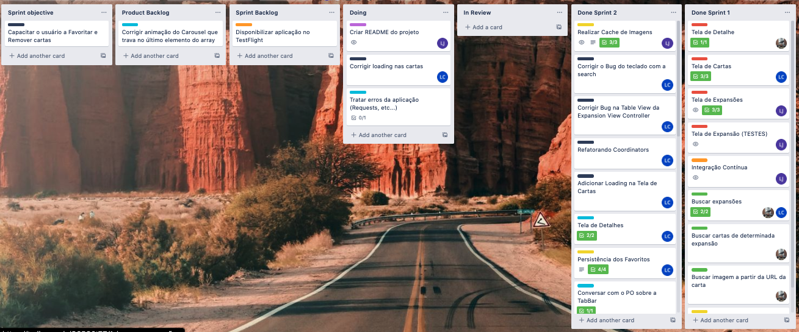
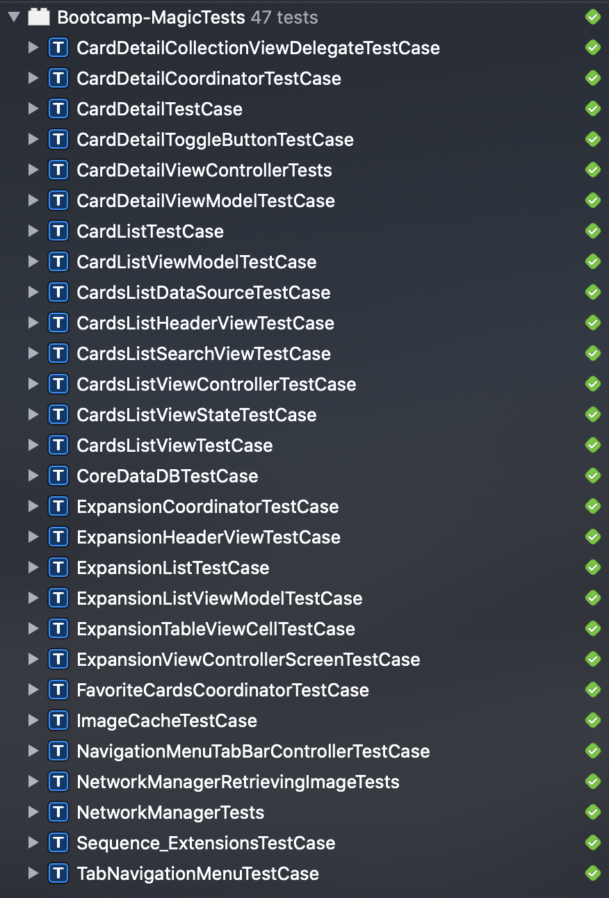
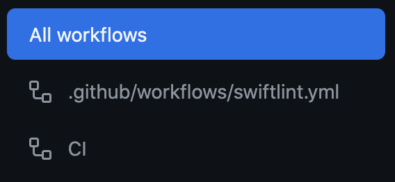
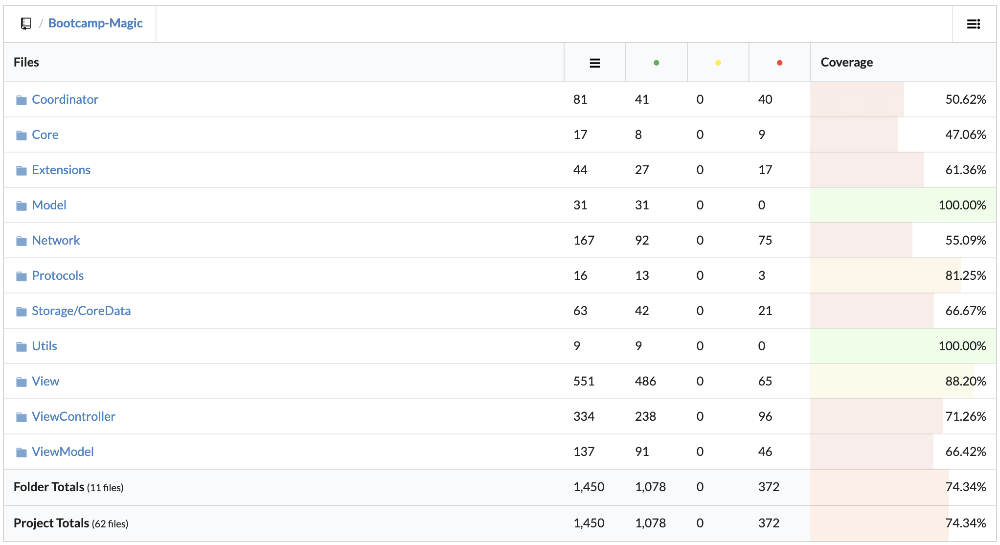

# Bootcamp Magic

O Bootcamp Magic é um aplicativo baseado no jogo [Magic: The Gathering](https://magic.wizards.com/), que permite o usuário visualizar cartas de variados *sets*, bem como favoritar as cartas que desejar. Este aplicativo consome uma [REST API](https://docs.magicthegathering.io/#documentationgetting_started) para mostar as cartas no aplicativo, assim, sendo necessário acceso a Internet para utilizá-lo.

## Arquitetura

MVVM-C (Model-View-ViewModel-Coordinator) foi a arquitetura adota para este projeto, com o intuito evitar ViewControllers massivas, garantir boa testabilidade e por atender a necessidade do projeto

## Gerência de Tarefas

Mesmo este sendo um projeto independente, teve-se preocupação por utilizar com a gerência de tarefas. Assim, baseado na metodologia [Kanban](https://www.atlassian.com/br/agile/kanban), foi criado um *board* no Trello para gerenciar as tarefas a serem feitas, bem como o estado de tarefa.

## Desenvolvimento da Interface

Para o desenvolvimento da interface do projeto foi escolhido o UIKit utilizando a abordagem de ViewCode. O ViewCode foi escolhido pois:

* Permite melhor reuzo e componentização;
* Permite melhor controle sobre o fluxo de inicialização;
* Melhor para trabalhar em equipe (não tem storyboard merge hell).

## Testes

Até o momento foram criados 47 testes automatizados para este projeto:

* 12 Testes são testes de snapshot, focados na interface da aplicação;
* 35 Testes são focados na parte de networking, viewmodel e demais classes que conteém lógica crucial do aplicativo;

## Integração Contínua

Foi configurado um CI para este projeto utilizando o [Github Actions](https://github.com/features/actions), com o intuito de evitar a regressão de código. O Workflow do CI consiste em duas etapas:

* **Lint:** faz uma análise estática no código do projeto, verificando se este está conforme as guidelines de código;
* **CI:** Roda o build e os testes da aplicação e, por fim, gera a cobertura de código.

O status atual do CI é:

## Gerenciamento de Dependências

O [Swift Package Manager](https://github.com/apple/swift-package-manager) foi a ferramenta escolhida para o gerenciamento das depedências do projeto, por trazer o benefício de ser completamente integrado com o Xcode, tornando o trabalho mais produtivo. Abaixo estão as depedências deste projeto:

* [SnapKit](https://github.com/SnapKit/SnapKit)
* [SnapshotTesting](https://github.com/pointfreeco/swift-snapshot-testing)

## Equipe

    

        
        <h2><a href="https://github.com/cs-pedro-silveira">Pedro Henrique</a></h2>
    

    

        
        <h2><a href="https://github.com/cs-lucas-costa">Lucas Henrique</a></h2>
    

    

        
        <h2><a href="https://github.com/cs-luis-avelino">Luis Gustavo</a></h2>
    

